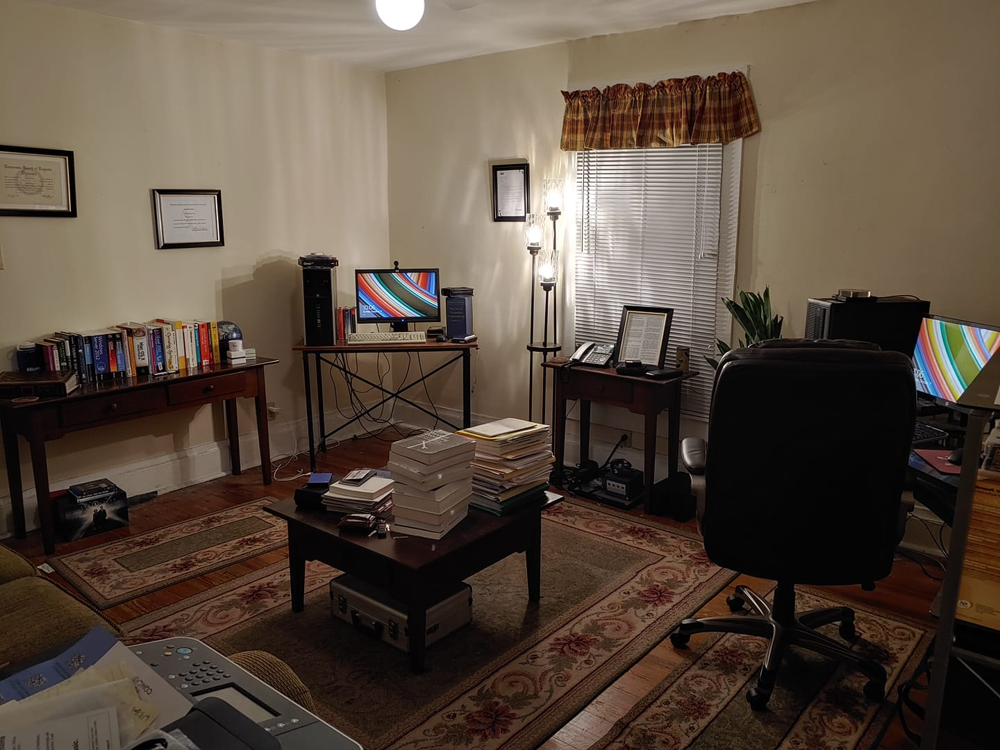

# Biograpghy
Jonathan-Moore-Biograpghy

My family is from Johnson City TN. we moved to Atlanta Ga for 5 years. while my dad was manager of McDonalds and offered a francise. He later worked as a manager in Building materials with a company owned by Fidelity investments. before he retired. We moved back to the Tri-Cities TN/Va We lived in 2 large houses before my mother became ill and we had to move into a condo. My first school was Sullins Academy. I didn't like the horror movies of the 80's because of Digital Corp. Haven't want many since. I went to St. Annes and Hollins Communications in Roanoke Va where I was diagnosed with a lateral lisp. I went to Virginia High School ant took AP English, AP Biology and 4 years of Latin. My first girlfriend was Michelle Hall. I listened to alternitive music in high school which was popular but didn't want to be famous just wanted to be known as good musicans. My Mom called an Atalata, Ga DJ in 1994 and got me copies of Pearl Jam's 'Private Radio' Broadcast. I went to a Tool concert with a stargazer or flat top classmate and got autographs and A Pearl Jam concert in 1998 on my own with a pass and played ping pong for 2 hrs backstge before the show. Didn't ask for autographs. 

My first job was at Grand Piano Home Funishings downtown Bristol, TN/VA I began my professional career right out of high school in technical support and development as a Macromedia User Group then later worked for Adobe and FreeBSD volunteer and contributor Where I studied ANN's or Artifical Nueral Networks for 2 years. At the same time pursuing my associates and bachelors in computer science. I graduated summa cum laude from Tenn. Tech in Carter County TN. and a UVa alumni and I'm COE and ABET Certified. I was also a web developer for the UVa-Wise Magazine. And Vice President of the ACM Wise Chapter I was a 2003 MSDN Student Ambassador and VHCC Scholar with award 3.5 GPA. I'm Windows Server 2003 and Microsoft SQL Server 2005 Certififed. In College I worked on Microsoft Biology Foundation with Microsoft Research offically and for my capstone I worked on a Missle Container project for Northup Grumman. Bought 5 MSDN Enterprise Supscriptions from 2003-2018 Bought a 2008 Mac Pro and Adobe Creative Suite 2.

My father remnarried which I did not approve of "The Witch that married my dad" she wanted a small business just didn't have the education for corporate contracts or bonds like me. She was mean to me. Not my father. I blame her for talking to McClure Racing thate lives across the street from my dad's house for mty Pyhosis.

I participated in Microsoft Research's Windows NT Source programs in 2003 and 2009 at UVa. Recieved a market Microsoft tender offer in 2005 which can be used I hope as an appraisial. I became a Microsoft Visual Studio industry partner in 2005 . And participatited in Microsoft Tech support from 2003-2013 with about 45 cases and letters from Bill Gates, Steve Ballmer and President Obama. My complete discography is available on Bandcamp. I'm a BMI writer and publisher. I went to #1 in Ambient on Reverbnation in 2019. And developed some small VST's and Rack Extensions for Reason Studios. I graduated Microsoft for Starups (Bizspark) in 2018 and joined Edx and Azure for Students to pursue my masters online.

I'm in the Virginia and National Associations for the Gifted since 2011 And IEEE Computer Society also a member of the Mensa High IQ society on LinkedIn I'm in the Windows CE Embedded Shared Source Program from 2003-present. I am wanting to pursue gifted studies at the University of Connecticut maybe. I scored a 140 on the Mensa mobile app. . I'm an INTJ- T top 2 percent of the global population. I'm Irish, German, Ashkenazi Jewish, Mediterranean (Tuscany) and Southwest Asian primate haplogroup's H3G1 and RZ-9. (R-Z9) H3G1 has a lot of protective alleles. Rare in Eastern Europe and haplogroup mtDNA R is Ashkenazi Jewish but Irish Jewish. and 1.6% Neanderthal And 2.6% Denisovan. Below the National Average of 2.4% . I was diagnosed with pychosis in 2001 but have a normal MRI. I've read in JSTOR the competition is againgst jewish law.

Current and past market holdings include Compuserve, AT&T, Cayan,
Vangaurad, Microsoft, Adobe, GOOGL, KSA, Apple, Macromedia, UBS, Fidelity, Blue Chip Growth Fund, with millions in shareholders equity for PP&E. Payroll contract with ADP. And with the .NET Foundation on a Microsoft Team.

I don't drink Alcholol, Smoke, or do illegal drugs. Moral, Loyal, Educated, Computer Science, Music, Swimming, Driving Range and Reading, I am a Moore #1 Irish pedigree. and Heritage activist. Microsoft Partner and in Adobe contract. Royal Society of the Arts Fellow. I don't believe in making a persons heritage extinct only forward and extant. I frequently read Burke's Peerage. I do not support the Supreme Courts ruling on Vriginia V. Loving. I do support the U.S's involvment with UNESCO and the United Nations. And cultural heritage laws. And I don't support same sex marriage. I support Theism and the Abrahamic Religions. I now Democrats are neoliberalist, Republicans end up in assisted living and the GOP is the party of fear, libitarians jest get served the green party ends upp on the street. and indepedandents ask too much I stay away from politics. And I also believe society is zero sum and will only go to fairs. I received straight A's in computer science in college at Tenn Tech and a 3.0 at UVa. Recently downloaded my SCO Open Server 5 what used to be MIcrosoft Xenix and wanting to install it on my older desktop.

I resecenly gave a substancal gift to the University of Washignton's Presidents Fund in memory of my mother and father. In hope to maybe someday soon to build their Spin Operating System. 'Spin the Black Circle' ---Via Va La Vinyl

[Competition in consumption as viewed by Jewish law](https://link.springer.com/article/10.1007/BF02388592)

[Restoring Nobility to the Constitution](https://papers.ssrn.com/sol3/papers.cfm?abstract_id=2335822)

[America Has a Nobility Problem](https://www.usatoday.com/story/opinion/2018/07/16/americas-nobility-problem-ruling-class-pays-no-consequences-failure-column/786512002/)

[Microsoft Heritage Activists Preserve.](https://news.microsoft.com/transform/heritage-activists-preserve-global-landmarks-ruined-in-war-threatened-by-time/)

[Where Is Justice When Someone With Schizophrenia is Wronged?](https://www.huffpost.com/archive/ca/entry/douglas-brown-schizophrenia_b_3377642)

[Conservitives Schizophinia CIA Unclassified](papers/CIA-RDP90-00965R000605140002-7.pdf)

[Maternal Influenza Viral Infection Causes Schizophrenia-Like Alterations of 5-HT2A and mGlu2 Receptors in the Adult Offspring](https://www.jneurosci.org/content/31/5/1863)

[Evolutionary Relationships among Extinct and Extant Sloths: The Evidence of Mitogenomes and Retroviruses Moore Extant 1954](https://academic.oup.com/gbe/article/8/3/607/2574116)

[11 of the oldest animals ever, ranked by age](https://www.businessinsider.com/some-of-worlds-oldest-animals-ranked-by-age-2019-4)

[Alex Jones blames conspiracy claims on ‘psychosis’](https://apnews.com/article/us-news-texas-lawsuits-connecticut-north-america-d577b2fac08d40c4bf56a662a9ab04cd)

[NIMH funding to shift away from DSM categories](https://www.apa.org/monitor/2013/07-08/nimh)

[When Moralirty is the Enemy](https://juicyecumenism.com/2018/08/10/roger-wolsey/)

[Terrorists and Democrats: Individual Reactions to International Attacks](https://www.jstor.org/stable/3792587)

[Damned Nation: Hell in America from the Revolution to Reconstruction](https://www.amazon.com/Damned-Nation-America-Revolution-Reconstruction/dp/0190662042)

[Spiritual Type Summaries](https://sites.google.com/site/godlypersonalities/spiritual-type-summaries)

RIP Paul Allen

